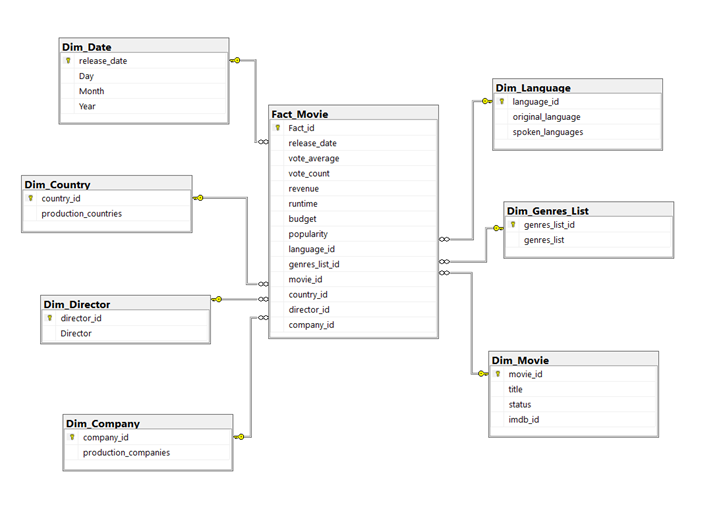

# 🎬 PHÂN TÍCH DỮ LIỆU PHIM TỪ IMDb & TMDb
### *Data Warehouse & OLAP Final Project*

**Tác giả:** Nguyễn Hồng Phát — *22521072*  
**Lớp:** IS217.P12  
**Liên hệ:** [LinkedIn](https://www.linkedin.com/in/your-profile-url/) | your.email@example.com

---

## 📌 1. Giới Thiệu Dự Án

Đây là đồ án cuối kỳ cho môn *Kho Dữ Liệu và OLAP*, tập trung vào phân tích dữ liệu phim từ hai nguồn lớn: **IMDb** và **TMDb**. Dự án mô phỏng quy trình thực tế trong doanh nghiệp, từ:

- Thiết kế **Data Warehouse** với lược đồ hình sao  
- Xây dựng **ETL Pipeline**  
- Phân tích dữ liệu qua **OLAP Cube**  
- Ứng dụng **Data Mining** để dự đoán mức độ thành công của phim  

---

## 🏗️ 2. Kiến Trúc Hệ Thống

Dự án tuân theo kiến trúc *Star Schema*, bao gồm:

- **1 bảng sự kiện (Fact_Movie)**  
- **7 bảng chiều (Dimension)**  

Luồng dữ liệu bao gồm:

```
Raw Data → ETL Pipeline (SSIS) → Data Warehouse → OLAP Cube (SSAS) → Data Analysis (MDX, Power BI, ML Models)
```

📌 *Sơ đồ kiến trúc tổng thể:*  



---

## ⚙️ 3. Các Thành Phần Kỹ Thuật

### 🔄 ETL Pipeline (SSIS)
Xây dựng quy trình **Extract – Transform – Load** bằng **SQL Server Integration Services (SSIS)** để:

- Thu thập dữ liệu từ IMDb & TMDb  
- Làm sạch, chuyển đổi dữ liệu  
- Nạp dữ liệu vào Data Warehouse  

### 📦 OLAP Cube (SSAS)
Dựng khối OLAP đa chiều với **SQL Server Analysis Services**, cho phép:

- Truy vấn dữ liệu bằng **MDX**  
- Phân tích dữ liệu theo chiều, cấp độ, và phân đoạn  

### 📊 Trực Quan Hóa Dữ Liệu
Kết nối **Power BI** và **Excel PivotTable** với OLAP Cube để:

- Xây dựng Dashboard  
- Trình bày các kết quả phân tích tương tác  

### 🤖 Dự Đoán Mức Độ Thành Công Phim
Xây dựng mô hình học máy bằng **Python** với các thuật toán:

- `LightGBM`, `CatBoost`, `Decision Tree`  
- Phân loại phim thành: *Hit*, *Average*, *Flop*  

---

## 🧰 4. Công Nghệ Sử Dụng

| Hạng mục               | Công cụ / Công nghệ                                           |
|------------------------|---------------------------------------------------------------|
| Cơ sở dữ liệu          | **SQL Server 2022**                                           |
| ETL & OLAP             | **SSIS**, **SSAS (Multidimensional)**                         |
| Ngôn ngữ truy vấn      | **T-SQL**, **MDX**                                            |
| Khai phá dữ liệu       | **Python**, **Pandas**, **Scikit-learn**, **LightGBM**, **CatBoost** |
| Môi trường Notebook    | **Jupyter Notebook**                                          |
| Trực quan hóa          | **Power BI**, **Excel**                                       |

---

## 🚀 5. Hướng Dẫn Cài Đặt & Triển Khai

### 5.1. Cài đặt cơ sở dữ liệu

- Yêu cầu: Cài đặt **SQL Server 2022** (bao gồm *Database Engine* và *Analysis Services – Multidimensional*)  
- Thực thi script `/Database/create_database.sql` để tạo **CSDL Movie_wh**

### 5.2. Triển khai ETL & OLAP

- Mở SSIS Project tại `/Source_Code/ETL-SSIS/` bằng **Visual Studio**  
- Chạy gói để thực hiện ETL và nạp dữ liệu vào Data Warehouse  
- Mở SSAS Project tại `/Source_Code/OLAP-SSAS/`, cập nhật `Data Source`, và **Deploy** Cube  

### 5.3. Phân tích & trực quan hóa

- Tham khảo các truy vấn **MDX** tại `/Source_Code/MDX Queries/`  
- Mở file Notebook tại `/Source_Code/Data Mining/` để khám phá mô hình dự đoán  
- Khám phá báo cáo và Dashboard tại `/Source_Code/Visualization/`
  
---

📬 **Mọi góp ý và phản hồi xin vui lòng liên hệ qua LinkedIn hoặc email cá nhân.**  
Cảm ơn bạn đã quan tâm đến dự án!
